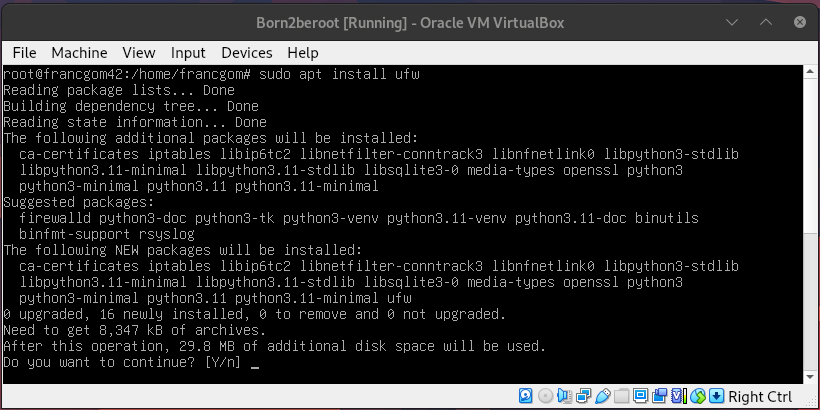
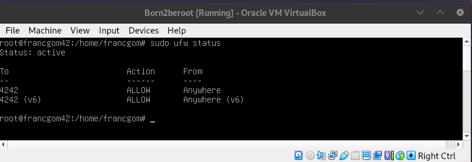
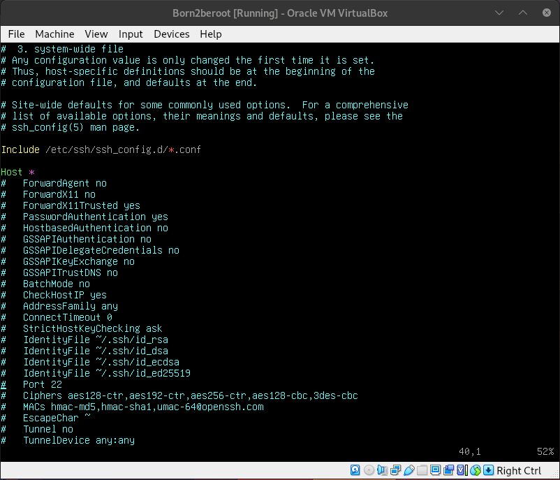
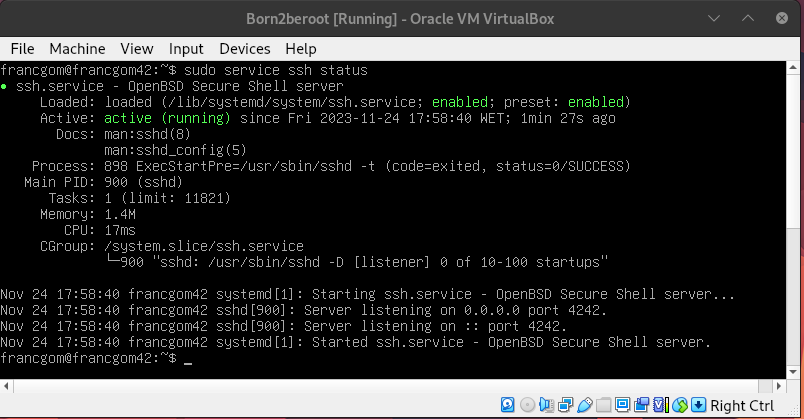
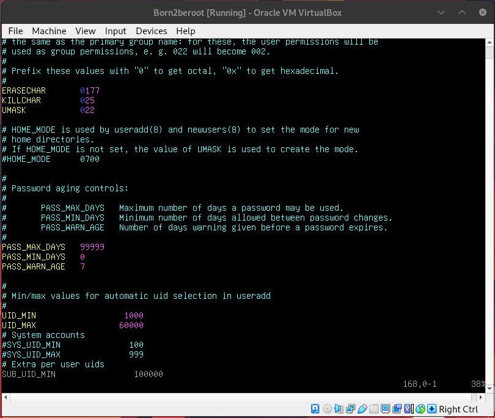
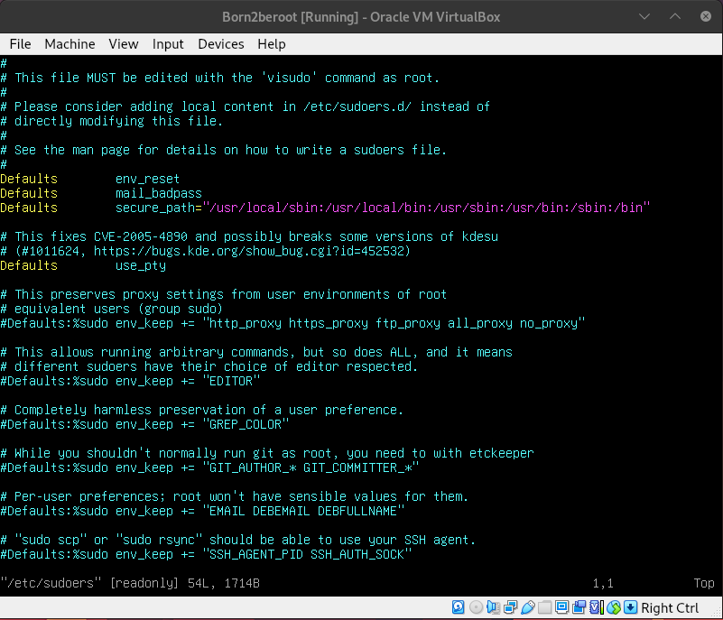

# <center>Tutorial Born2beroot </center>

## Indice

1. [Criação da Maquina Virtual 💻](#1-criação-da-maquina-virtual-)
2. [Instalação do Debian 💽](#2-instalação-do-debian-)
3. [Instalação do UFW 🔥🧱](#3-instalação-do-ufw-)
4. [Instalação do SSH 🛜](#4-instalação-do-ssh-)

	4.1 [Configuração do SSH](#41-configuração-do-ssh)

	4.2 [Realizando uma conexão SSH](#42-realizando-uma-conexão-ssh)

5. [Criação de Usuarios e Grupos 👤👥](#5-criação-de-usuarios-e-grupos-)
6. [Implementando política de senha forte 🔑](#6-implementando-política-de-senha-forte-)

	6.1 [Característica temporal da senha](#61-característica-temporal-da-senha)

	6.2 [Carecterística textual da senha](#62-carecterística-textual-da-senha)

	6.3 [Adicionando mais segurança para o Sudo](#63-adicionando-mais-segurança-para-o-sudo)

7. [Criação de Script 📜](#7-criação-de-script-)
8. [Contrab ⏰](#8-contrab-⏰)
9. [Instalação de um servidor web 🖥](#9-instalação-de-um-servidor-web-)


## 1. Criação da Maquina Virtual 💻

## 2. Instalação do Debian 💽

## 3. Instalação do UFW 🔥🧱

<p> <b>UFW</b> é uma ferramenta de configuração de firewall, que é um dispositivo de segurança de rede que cuida do trafego de informações bloqueando ou permitindo passagens de dados dependendo das regras configuradas.</p>

**3.1** Instale o UFW utilizando o comando ```sudo apt install ufw``` e confirme com ```y```.<br>


**3.2.** Ative o UFW 
```bash
sudo ufw enable
```
**3.3** Permita o acesso a porta **4242**

```bash
sudo ufw allow 4242
```
**3.4.** Ative o serviço do UFW ao iniciar o sistema operacional 
```bash
systemctl enable ufw
```
**3.5.** Cheque as portas autorizadas (IPV4 e IPV6) 
```bash
sudo ufw status
```


## 4. Instalação do SSH 🛜
### 4.1. Configuração do SSH
<p> **SSH** é um protocolo utilizado pra troca de dados entre cliente e servidor remoto de forma segura e dinâmica. Ele possibilita a comunicação criptografada através da rede permitindo acessar e fazer alterações em outro computador através do terminal.<p>

**4.1.1** Instale o servidor SSH 
```bash
sudo apt install openssh-server
```
**4.1.2.** Ative o servico do SSH ao iniciar o sistema operacional
```bash
sudo systemctl enable sshd
```
**4.1.3.** Altere a porta **22** do SSH para **4242**, editando o arquivo ```/etc/ssh/sshd_config```, e alterando ```#Port 22``` para ```#Port 4242```.
```bash
sudo vim /etc/ssh/sshd_config
```


**4.1.4.** Reiniciando o servico
```bash
sudo systemctl restart sshd
```
**4.1.5.** Verifique os status do servico
```bash
sudo sudo service ssh status
```


### 4.2. Realizando uma conexão SSH
**4.2.1.** Verifique qual é o IP da sua maquina virtual
```bash
hostname -I
``` 
**4.2.2.** Na sua maquina (*cliente*) faca a conexão utilizando seu usuario e senha
```bash
ssh <seu usuário>@<seu ip> -p 4242
```


## 5. Criação de Usuarios e Grupos 👤👥
Um *usuário* é uma entidade que pode executar processos e ser dono de arquivos. Um usuário está associado a um nome de usuário e a um **id** *(userid)*.
Os *grupos* correspondem a conjuntos de usuários. O principal propósito dos grupos é permitir que um usuário compartilhe acesso a arquivos com outros usuários em um grupo. 


## 6. Implementando política de senha forte 🔑
### 6.1 Característica temporal da senha
Edite o arquivo ```/etc/login.defs/``` alterando as seguintes flags

| Antes | Depois | Descrição |
|--- |--- |--- |
| PASS_MAX_DAYS 99999  |```PASS_MAX_DAYS 30```| tempo de expiração da palavra-passe |
| PASS_MIN_DAYS 0 |```PASS_MIN_DAYS 2```| número mínimo de dias permitido antes de alterar uma palavra-passe |
| PASS_WARN_AGE 7 |```PASS_WARN_AGE 7```| úmero de dias especificado permanece até a sua senha expirar |
```bash
sudo sudo vim /etc/login.defs/
```


### 6.2 Carecterística textual da senha
**6.2.1** Instalar o pacote adicional **libpam-pwquality**
```bash
sudo apt install libpam-pwquality
```
**6.2.2.** Edite o arquivo ```/etc/security/pwquality.conf```

| Antes | Depois | Características do Password |
|--- |--- |--- |
| # minlen = 8  |```minlen = 10```| Pelo menos 10 caracteres |
| # ucredit = 0 |```ucredit = -1```| Pelo menos um letras maiúscula |
| # dcredit = 0 |```dcredit = -1```| Pelo menos 1 número |
| # maxrepeat = 0 |```maxrepeat = 3```| Não deve conter 3 caracteres idênticos consecutivos |
| # usercheck = 1 |```usercheck = 1```| Não deve incluir o nome do usuário |
| # retry = 3 |```retry = 3```| 	A autenticação usando sudo deve ser limitada a 3 tentativas|
| # difok = |```difok = 7```| Deve ter pelo menos 7 caracteres que não façam parte da senha antiga |
| # enforce_for_root | ```enforce_for_root```| Para aplicar toda a política acima para o root | 

```bash
sudo sudo vim /etc/security/pwquality.conf
```


### 6.3 Adicionando mais segurança para o Sudo
Edite o arquivo ```/etc/sudoers```

| Linha | Descrição |
|--- |--- |
|```Defaults passwd_tries = 3```| Limitando o maximo de tentativa a 3 |
|```Defaults requiretty```| Ativa o modo TTY |
|```Defaults	logfile="/var/log/sudo/sudo.log"```| Arquivo onde serão salvas os comandos |
|```Defaults log_input,log_output```| define que serão salvas as entradas e saidas dos comandos |
|```Defaults badpass_message="<sua mensagem>"```| Mensagem personalizada de erro ao usar o sudo |


```bash
sudo sudo vim /etc/sudoers
```


Inclua também a linha
```Defaults  secure_path="/usr/local/sbin:/usr/local/bin:/usr/sbin:/usr/bin:/sbin:/bin:/snap/bin"```
Para restringir acesso a esses diretórios

## 7. Criação de Script 📜
No projeto é solicitada a criaćão do script ```monitoring.sh``` que deve:

```bash
#!bin/bash

#Apresentar arquitetura do seu sistema operacional e sua versão do kernel
ARCH=$(uname -a | awk '{print $7 " " $3}' )

#O número de processadores físicos
CPUF=$(cat /proc/cpuinfo | grep "physical id" | wc -l)

#O número de processadores virtuais
CPUV=$(cat /proc/cpuinfo | grep "processor" | wc -l)

#A RAM disponível atualmente em seu servidor e sua taxa de utilização como uma porcentagem
RAM_TOTAL=$(free --mega | awk '$1 == "Mem:" {print $2}')
RAM_USE=$(free --mega | awk '$1 == "Mem:" {print $3}')
RAM_PERCENT=$(free --mega | awk '$1 == "Mem:" {printf("%.2f"), $3/$2*100}')

#A memória de disco (HD) atual disponível em seu servidor e sua taxa de utilização como uma porcentagem;
DISK_TOTAL=$(df -h --total | grep "total" | awk '{printf("%.0f"), $2}')
DISK_USE=$(df -m --total | grep "total" | awk '{print $3}')
DISK_PERCENT=$(df -h --total | grep "total" | awk '{print $5}')

# A taxa de utilização atual de seus processadores como uma porcentagem;
LCPU=$(top -bn1 | grep "^%Cpu" | awk '{printf("%.1f%%"), $2 + $4}')

#A data e hora da última reinicialização;
LASTBOOT=$(who -b | awk '{print $3 " " $4}')

#Se o LVM está ativo ou não
USAGELVM=$(lsblk | if grep -q "lvm";then echo "yes"; else echo "no"; fi)

#O número de conexões ativas;
NCONEX=$(ss -ta | grep ESTAB | wc -l)

#O número de usuários usando o servidor
NUSER=$(users | wc -w)

#O endereço IPv4 do seu servidor e seu endereço MAC (Media Access Control)
MY_IP=$(hostname -I | awk '{print $1}')
MY_MAC=$(ip link | grep "link/ether" | awk '{print $2}')

#O número de comandos executados com o programa sudo.
NCMD_SUDO=$(cat /var/log/sudo/sudo.log | grep 'COMMAND' | wc -l)

wall "
        # Architecture: $ARCH
        # CPU physical: $CPUF
        # vCPU: $CPUV
        # Memory Usage: $RAM_USE/${RAM_TOTAL}MB ($RAM_PERCENT%)
        # Disk Usage: $DISK_USE/${DISK_TOTAL}GB ($DISK_PERCENT)
        # CPU load: $LCPU
        # Last boot: $LASTBOOT
        # LVM use: $USAGELVM
        # Connections TCP: $NCONEX
        # User log: $NUSER
        # Network: IP $MY_IP $MY_MAC
        # Sudo: $NCMD_SUDO cmd
"

```
Na construćão do script foi utilizado o operador pipe ```|``` que permite enviar a saída de um comando para outro, na maioria das vezes as saídas foram enviadas para que fossem aplicados os comandos  ```grep  awk  wc```.
* O comando ```grep``` retorna as linhas que possuem determinada ocorrência, por exemplo ```grep "physical id"``` retorna as linhas linhas que possuem o texto *physical id*.
* O comando ```awk``` retorna o conteúdo de uma determina coluna, por exemplo ```awk '{print $3 " " $4}``` retorna os conteúdos das colunas 3 e 4.
* O comando ```wc``` também conhecido como *word counter*, conta palavras quando escrito ```wc -w``` e conta linhas quando ```wc -l```.
Para compreender como o script funciona, sugir que execute cada linha que esta dentro de ```$( )```, faća isso por partes antes de cada pipe ```|``` e analise o resultado.

## 8. Contrab ⏰

## 9. Instalação de um servidor web 🖥
*O Lighttpd* é um servidor web de código aberto e de alta performance. Ele foi projetado para ser rápido, seguro, flexível e eficiente em termos de uso de recursos, sendo uma alternativa popular ao Apache ou Nginx.
